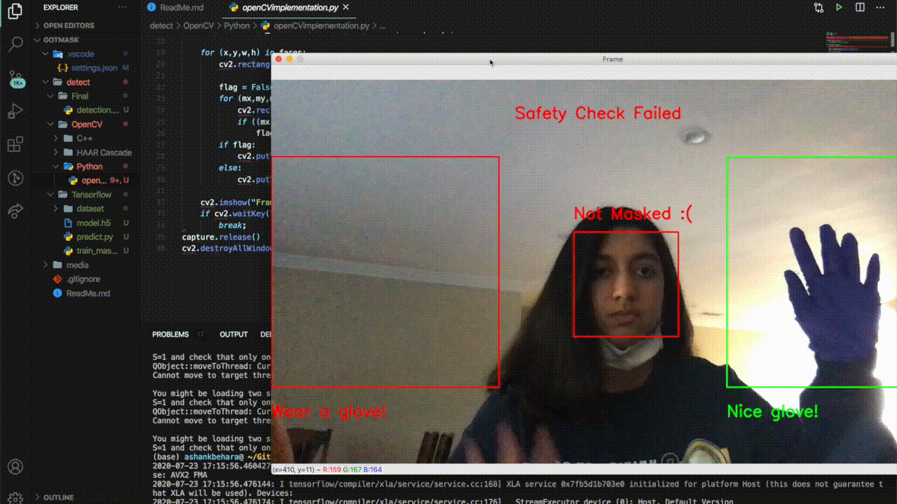
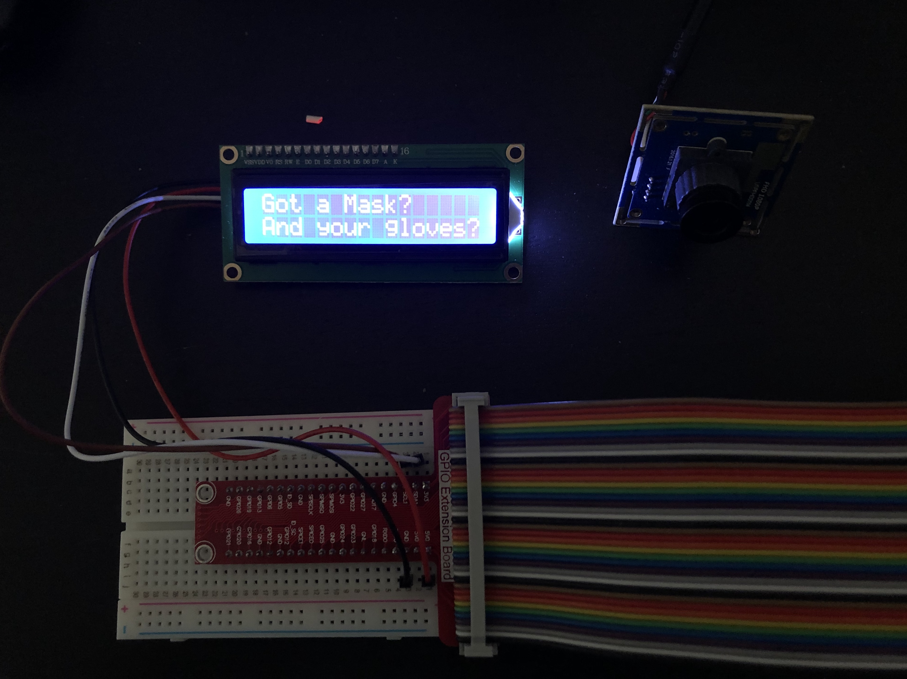

# Got a Mask?

This project is a means to screen medical and non personell to make sure that they are wearing adequate equipment prior to entering a building. 

## Overview

The capture is segmented into two segments for hand detection which was passed through a CNN built with ```Tensorflow``` and ```Keras```. The transfer learning model is held in the ```./detect/Tensorflow/model.h5``` file if you want to run your own glove detection for a project.

 The mask detection is done with a HAAR Cascade Classifier implemented in ```OpenCV```. It tracks the mouth and frontal face and if there is a mouth contained in the frontal face it identifies the person as unmasked. If two gloves and a masked face are detected in the frame, the system will print out that all safety checks have passed. The standalone python script can be found in ```./detect/Final/detect_isolated.py``` if you want to run this code without the hardware<br/>





## Raspberry Pi Setup

### Downloads

The major installs to run the file ```./detect/Final/detect_integrated.py``` successfully on the Raspberry Pi are Tensorflow, Keras and OpenCV. The install for opencv is fairly straightforward as all it needs is a pip install. Due to the ARM architecture of the board, the install of Tensorflow and Keras are a little more complicated run the following bash commands in order to install all the necessary dependencies

```
pip install opencv-contrib-python==4.1.0.25
sudo apt-get install -y libhdf5-dev libc-ares-dev libeigen3-dev
python3 -m pip install keras_applications==1.0.8 --no-deps
python3 -m pip install keras_preprocessing==1.1.0 --no-deps
python3 -m pip install h5py==2.9.0
sudo apt-get install -y openmpi-bin libopenmpi-dev
sudo apt-get install -y libatlas-base-dev
python3 -m pip install -U six wheel mock
wget https://github.com/lhelontra/tensorflow-on-arm/releases/download/v2.0.0/tensorflow-2.0.0-cp37-none-linux_armv7l.whl
sudo python3 -m pip uninstall tensorflow
sudo python3 -m pip install tensorflow-2.0.0-cp37-none-linux_armv7l.whl
```
### Configuration

The circuit I built require use of an i2c interface and external camera. Run the following command to open the configuration.

```sudo raspi-config```

Navigate to ```5 Interfacing Options``` and follow the instructions to enable ```P1 Camera``` and ```P5 I2C```. Toggling on the camera will force the system to reboot to apply the changes

### Assembly of Hardware

The circuit was assembeled using the Sunfounder Kit. I used the breadboard, jumper cables, and the LCD1602 display. The circuit itself is very simple and takes <1 minute to install correctly. Below is an image of the circuit. Additionally, there is  USB camera that is plugged into the Pi board which Debian Linux will pick up as the camera to use to open the capture.

 </img>

### Optional

Coral TPU
