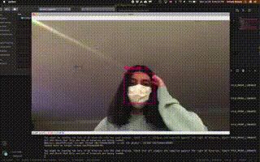

# Got a Mask?

So far, I have completed a purely OpenCV implementation of the script using C++ and Python. Here is a video of the real time object detection code run using my Macbook Webcam on my little sister. I will be writing implementations with YOLO based R-CNN's on masked-person data sets later in order to increase robustness and accuracy of the detection.    

The gif quality is quite rough as Github only accepts smaller videos and files, but if you want to see a clearer video with the text not as pixelated check out this public YouTube URL: [https://www.youtube.com/watch?v=OMjjTuqWezg](https://www.youtube.com/watch?v=OMjjTuqWezg)   

